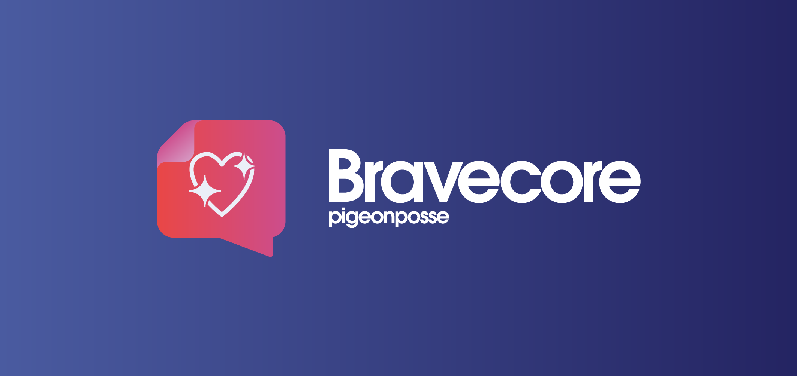

# Bravecore by _PIGEONPOSSE_

[](https://npmjs.com/package/bravecore)

[](https://pigeonposse.com/)
[](https://pigeonposse.com/?popup=about)
[](https://github.com/pigeon-posse)
[](https://pigeonposse.com/?popup=donate)

[](https://npmjs.com/package/bravecore)
[](https://npmjs.com/package/bravecore)
[](https://npmjs.com/package/bravecore)

## Human mental processes in artificial intelligence

> ⚠️ Pre-alpha version.

**Bravecore** is an _innovative software platform_ designed to integrate emotional intelligence into artificial intelligence systems. Through a robust set of libraries and tools, Bravecore provides a _comprehensive solution for analyzing, interpreting, and responding to emotions across various contexts, from text and audio to images and video_. This platform not only enables a deep understanding of human emotions but also facilitates more natural and empathetic interactions with machines.

## Key Features

* 💖 **Multimodal Integration:** Combines analysis of text, audio, and images into a cohesive solution, offering a holistic understanding of emotional states. This integration provides a more accurate and comprehensive view compared to tools that focus on a single data type.
* 🧠 **Complete Emotion and Consciousness Simulation:** Features advanced simulations of consciousness and self-reflection, mimicking complex internal processes similar to human thought. This unique capability allows AI systems to go beyond simple responses and engage in introspective processes.
* 📝 **Emotional Content Generation:** Generates contextually appropriate and emotionally adapted responses and content. This feature enhances practical applications such as customer service, marketing, and education by providing emotionally relevant interactions.

## Features

* 💖 **Emotions Management:** Tracks and manages a wide range of human emotions.
* 🗣️ **Advanced NLP:** Analyzes sentiment and detects irony in text.
* 🎧 **Multimodal Analysis:** Evaluates emotions through audio, images, and video.
* 🧩 **Complex Emotional Models:** Utilizes Circumplex and Plutchik models for nuanced emotion assessment.
* 🧠 **Cognitive Aspects:** Simulates theory of mind and emotional memory.
* 🌐 **Multilingual Support:** Offers language detection and emotion translation.
* 🔍 **Bias Adjustment:** Detects and adjusts for bias in AI models.
* 📝 **Emotional Content Generation:** Creates contextually appropriate emotional responses.
* 📊 **Explainability Engine:** Provides detailed decision logs and transparency.
* 🤖 **Consciousness Simulation:** Simulates self-reflection and inner dialogue.
* 🌟 **Subjective Experience Simulation:** Captures and simulates personal experiences and beliefs.

Bravecore is designed to improve human-machine interaction by enabling _AI systems to understand and respond more empathetically and accurately to human emotions_. Its applications range from virtual assistants and customer support to well-being analytics and personalized content generation. In addition, its focus on explainability and fairness contributes to a more responsible and transparent development of artificial intelligence.

With Bravecore, _emotional intelligence_ becomes an integral part of the technology, offering advanced and personalized solutions for a wide range of needs and contexts.

## Prerequisites

* installation of `ollama`

## Installation

To install the library, use npm or yarn:

```bash
# Using npm
npm install bravecore

# Using pnpm
pnpm install bravecore

# Using yarn
yarn add bravecore
```

## ☕ Donate

Help us to develop more interesting things.

[](https://pigeonposse.com/?popup=donate)

## 📜 License

This software is licensed with **[GPL-3.0](/LICENSE)**.

[](/LICENSE)

## 🐦 About us

*PigeonPosse* is a ✨ **code development collective** ✨ focused on creating practical and interesting tools that help developers and users enjoy a more agile and comfortable experience. Our projects cover various programming sectors and we do not have a thematic limitation in terms of projects.

[](https://github.com/pigeonposse)

### Collaborators

|                                                                                    | Name        | Role         | GitHub                                         |
| ---------------------------------------------------------------------------------- | ----------- | ------------ | ---------------------------------------------- |
|  | Alejo |   Author & Development   | [@alejomalia](https://github.com/alejomalia) |
|  | PigeonPosse | Collective | [@PigeonPosse](https://github.com/PigeonPosse) |

<br>
<p align="center">

[](https://pigeonposse.com)
[](https://pigeonposse.com?popup=about)
[](https://pigeonposse.com/?popup=donate)
[](https://github.com/pigeonposse)
[](https://twitter.com/pigeonposse_)
[](https://www.instagram.com/pigeon.posse/)
[](https://medium.com/@pigeonposse)

</p>
